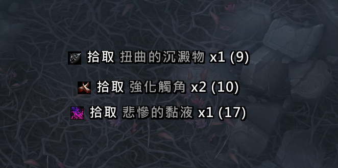
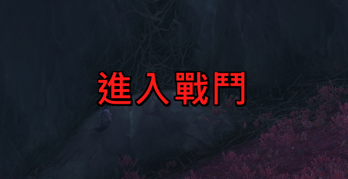

# LootG 拾取通知


**LootG** 是一个轻量级的魔兽世界拾取通知和战斗状态显示插件。推荐和 Leatrix_Plus 关闭横幅功能一起使用。




## 功能特点

### 拾取通知
- **滚动拾取显示** - 拾取的物品以流畅的动画向上滚动
- **品质颜色** - 物品按品质颜色显示（普通、优秀、精良、史诗、传说）
- **物品图标** - 在物品名称旁显示物品图标
- **背包数量** - 显示背包中该物品的总数量（仅当数量 > 0 时显示）
- **货币与金币** - 同样支持显示拾取的货币和金币
- **自定义位置** - 拖动蓝色锚点可将显示位置移动到屏幕任意位置
- **简洁界面** - 只显示你自己的拾取，不显示队友的

### 战斗状态
- **进入/脱离战斗闪烁** - 进入和脱离战斗时显示闪烁文字提示
- **滚动与静态模式** - 可选滚动动画或静态显示
- **四方向滚动** - 支持向上、向下、向左、向右滚动
- **自定义文字** - 可设置自定义进入/脱离战斗文字
- **独立锚点** - 拖动红色锚点单独定位战斗文字

### 通用
- **独立字体设置** - 每个模块有独立的字体、字号、描边和阴影设置
- **多语言支持** - 支持英文、简体中文、繁体中文

## 安装方法

1. 下载并解压 `LootG` 文件夹
2. 将其放入 `World of Warcraft\_retail_\Interface\AddOns\` 目录
3. 重启魔兽世界或重载界面（`/reload`）

## 使用方法

### 命令

- `/lootg` - 打开设置面板
- `/lootg test` - 显示测试拾取消息

### 设置

通过以下方式访问设置：
- 在聊天框输入 `/lootg`
- 点击小地图旁的插件按钮中的 LootG 图标
- 游戏菜单 → 选项 → 插件 → LootG

### 拾取通知设置

| 设置 | 说明 |
|------|------|
| **启用** | 启用/禁用拾取通知 |
| **锁定位置** | 锁定/解锁蓝色锚点以调整位置 |
| **显示图标** | 开关物品图标显示 |
| **X/Y 坐标** | 微调显示位置 |
| **滚动方向** | 向上或向下 |
| **显示时间** | 消息显示时长（0.5-10秒） |
| **滚动时间** | 动画速度（0.1-5秒） |
| **渐隐速度** | 淡出时长（0.1-2秒） |
| **字号** | 文字大小（8-48） |
| **字体** | 可选标准、聊天、伤害、任务字体 |
| **字体描边** | 无、细描边、粗描边、单色 |
| **字体阴影** | 启用/禁用文字阴影 |

### 战斗状态设置

| 设置 | 说明 |
|------|------|
| **启用** | 启用/禁用战斗状态闪烁 |
| **锁定位置** | 锁定/解锁红色锚点以调整位置 |
| **X/Y 坐标** | 微调显示位置 |
| **进入/脱离战斗文字** | 自定义文字（留空使用本地化默认值） |
| **显示模式** | 滚动或静态 |
| **滚动方向** | 向上、向下、向左、向右 |
| **显示时间** | 闪烁时长（0.1-3秒） |
| **滚动速度** | 动画速度倍率（0.1-5） |
| **渐隐时间** | 淡出时长（0.1-3秒） |
| **字号** | 文字大小（8-72） |
| **字体** | 可选标准、聊天、伤害、任务字体 |
| **字体描边** | 无、细描边、粗描边、单色 |
| **字体阴影** | 启用/禁用文字阴影 |

设置面板分为：
- **LootG**（主页）- 插件简介
- **拾取通知**（子分类）- 所有拾取显示设置
- **战斗状态**（子分类）- 所有战斗闪烁文字设置

## 显示格式

### 拾取
```
[图标] 拾取 物品名称 x1 (背包数量)
```

### 战斗状态
```
进入战斗    （红色闪烁文字）
脱离战斗    （绿色闪烁文字）
```

## 截图

*即将推出*

## 更新日志

### v1.1.0
- 新增战斗状态闪烁文字模块，支持滚动/静态模式和四方向滚动
- 分类设置面板，每个模块独立锚点和字体设置
- 多语言界面标签，UI 布局优化

### v1.0.0
- 首次发布
- 带动画的滚动拾取显示
- 物品品质颜色、可自定义字体和位置

## 许可

本插件可自由使用和修改。

## 作者

**Claude** (Anthropic 的 AI 助手)

---

*为魔兽世界社区用心制作*
